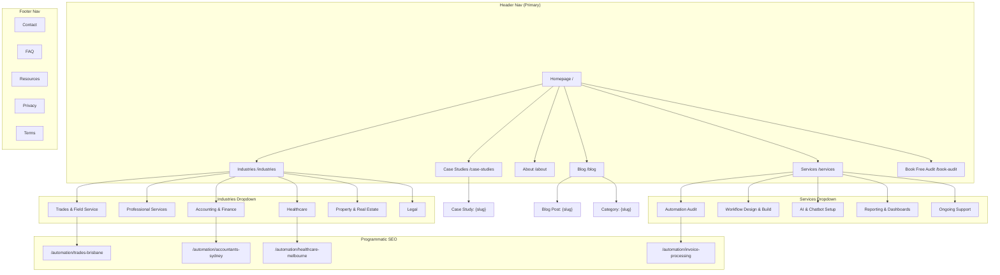

# Site Architecture — kurtisdunn.com.au

## Business Context

- **Type**: Small business / service-based consulting site with content marketing
- **Operator**: Solo consultant (Kurtis Dunn), onshore Australia
- **Audiences**: SMB owners & ops managers (5–50 staff), service businesses
- **Top 3 goals**: (1) Audit bookings, (2) SEO traffic from industry + location queries, (3) Authority/trust building
- **State**: Redesign from existing site — no legacy URLs requiring preservation

---

## Page Hierarchy (ASCII Tree)

```
Homepage (/)
├── Services (/services)
│   ├── Automation Audit (/services/automation-audit)
│   ├── Workflow Design & Build (/services/workflow-design)
│   ├── AI & Chatbot Setup (/services/ai-chatbot-setup)
│   ├── Reporting & Dashboards (/services/reporting-dashboards)
│   └── Ongoing Support (/services/ongoing-support)
├── Industries (/industries)
│   ├── Trades & Field Service (/industries/trades)
│   ├── Professional Services (/industries/professional-services)
│   ├── Accounting & Finance (/industries/accounting-finance)
│   ├── Healthcare & Allied Health (/industries/healthcare)
│   ├── Property & Real Estate (/industries/property-real-estate)
│   └── Legal (/industries/legal)
├── About (/about)
├── Case Studies (/case-studies)
│   └── [Individual Case Study] (/case-studies/{slug})
├── Blog (/blog)
│   ├── [Blog Post] (/blog/{slug})
│   └── [Category Archive] (/blog/category/{slug})
├── Resources (/resources)
│   ├── Automation ROI Calculator (/resources/automation-roi-calculator)
│   └── [Downloadable Guides] (/resources/{slug})
├── Contact (/contact)
├── Book Your Free Audit (/book-audit) ← Primary CTA landing page
├── FAQ (/faq)
├── Privacy Policy (/privacy)
├── Terms of Service (/terms)
└── Programmatic SEO Pages
    ├── /automation/{industry}-{location}
    │   e.g. /automation/trades-brisbane
    │   e.g. /automation/accountants-sydney
    │   e.g. /automation/healthcare-melbourne
    └── /automation/{use-case}
        e.g. /automation/invoice-processing
        e.g. /automation/appointment-scheduling
        e.g. /automation/job-management
```

---

## Visual Sitemap (Mermaid)



---

## URL Map Table

| Page | URL | Parent | Nav Location | Priority | Purpose |
|------|-----|--------|-------------|----------|---------|
| Homepage | `/` | — | Header (logo) | Critical | Primary conversion page, establishes positioning |
| Services Hub | `/services` | Homepage | Header | High | Overview of all services, links to detail pages |
| Automation Audit | `/services/automation-audit` | Services | Header dropdown | High | Detailed service page, links to /book-audit |
| Workflow Design | `/services/workflow-design` | Services | Header dropdown | High | Core service offering |
| AI & Chatbot Setup | `/services/ai-chatbot-setup` | Services | Header dropdown | Medium | Emerging service offering |
| Reporting & Dashboards | `/services/reporting-dashboards` | Services | Header dropdown | Medium | Supporting service |
| Ongoing Support | `/services/ongoing-support` | Services | Header dropdown | Medium | Retention service |
| Industries Hub | `/industries` | Homepage | Header | High | Hub page for all verticals |
| Trades & Field Service | `/industries/trades` | Industries | Header dropdown | High | Top vertical — highest volume |
| Professional Services | `/industries/professional-services` | Industries | Header dropdown | High | Key vertical |
| Accounting & Finance | `/industries/accounting-finance` | Industries | Header dropdown | High | Key vertical |
| Healthcare | `/industries/healthcare` | Industries | Header dropdown | Medium | Growth vertical |
| Property & Real Estate | `/industries/property-real-estate` | Industries | Header dropdown | Medium | Growth vertical |
| Legal | `/industries/legal` | Industries | Header dropdown | Medium | Growth vertical |
| About | `/about` | Homepage | Header | Medium | Trust-building, founder story |
| Case Studies Hub | `/case-studies` | Homepage | Header | Medium | Social proof hub |
| Case Study Detail | `/case-studies/{slug}` | Case Studies | — | Medium | Individual proof points |
| Blog Hub | `/blog` | Homepage | Header | Medium | Content marketing hub |
| Blog Post | `/blog/{slug}` | Blog | — | Medium | SEO + authority content |
| Blog Category | `/blog/category/{slug}` | Blog | — | Low | Category archives |
| Resources Hub | `/resources` | Homepage | Footer | Low | Lead magnets and tools |
| ROI Calculator | `/resources/automation-roi-calculator` | Resources | Footer | Medium | Interactive lead gen tool |
| Contact | `/contact` | Homepage | Footer + Header (secondary) | Medium | General enquiries |
| Book Audit | `/book-audit` | Homepage | Header CTA button | Critical | Primary conversion page |
| FAQ | `/faq` | Homepage | Footer | Low | Objection handling, SEO |
| Privacy Policy | `/privacy` | Homepage | Footer | Low | Legal compliance |
| Terms of Service | `/terms` | Homepage | Footer | Low | Legal compliance |
| pSEO: Industry × Location | `/automation/{industry}-{location}` | Industries | — (organic only) | Medium | Programmatic SEO pages |
| pSEO: Use Case | `/automation/{use-case}` | Services | — (organic only) | Medium | Programmatic SEO pages |

---

## Navigation Spec

### Header Navigation (Desktop)

**Left:** Logo (links to `/`)

**Centre/Right menu (6 items + CTA):**
1. **Services** (dropdown)
   - Automation Audit
   - Workflow Design & Build
   - AI & Chatbot Setup
   - Reporting & Dashboards
   - Ongoing Support
2. **Industries** (dropdown)
   - Trades & Field Service
   - Professional Services
   - Accounting & Finance
   - Healthcare
   - Property & Real Estate
   - Legal
3. **Case Studies** (direct link)
4. **Blog** (direct link)
5. **About** (direct link)
6. **Contact** (direct link, secondary style)
7. **[CTA Button] Book Free Audit** → `/book-audit` (primary button, always visible)

### Header Navigation (Mobile)

- Hamburger menu, full-screen overlay
- Same items, accordions for dropdowns
- Sticky CTA button at bottom of screen ("Book Free Audit")
- Phone number visible at top

### Footer Sections

| Column 1: Services | Column 2: Industries | Column 3: Resources | Column 4: Company |
|---|---|---|---|
| Automation Audit | Trades & Field Service | Blog | About |
| Workflow Design | Professional Services | Case Studies | Contact |
| AI & Chatbot Setup | Accounting & Finance | ROI Calculator | FAQ |
| Reporting & Dashboards | Healthcare | | Privacy |
| Ongoing Support | Property & Real Estate | | Terms |
| | Legal | | |

**Footer bottom bar:** © 2026 Kurtis Dunn | ABN: [number] | Australian-owned & operated

### Breadcrumb Implementation

All pages except homepage. Format:

```
Home > Services > Automation Audit
Home > Industries > Trades & Field Service
Home > Blog > [Post Title]
Home > Case Studies > [Case Study Title]
```

Breadcrumbs generate BreadcrumbList schema automatically (see Step 10).

---

## Internal Linking Plan

### Hub-and-Spoke Structure

**Hub 1: Services Hub (`/services`)**
- Spokes: All 5 service detail pages
- Each spoke links back to hub and to `/book-audit`
- Cross-links: Each service page links to 1–2 relevant industry pages

**Hub 2: Industries Hub (`/industries`)**
- Spokes: All 6 industry vertical pages
- Each spoke links back to hub and to `/book-audit`
- Cross-links: Each industry page links to 2–3 relevant service pages and 1 case study

**Hub 3: Blog Hub (`/blog`)**
- Topic clusters (see Content Strategy, Step 3):
  - Automation Basics → pillar + spokes
  - Industry-Specific Tips → pillar + spokes
  - Tool Guides → pillar + spokes
- Each post links to: relevant service page, relevant industry page, `/book-audit`

### Cross-Section Linking Rules

| From Page | Links To | Anchor Text Pattern |
|-----------|----------|-------------------|
| Industry page | 2–3 service pages | "See how we [service] for [industry]" |
| Industry page | 1 case study | "Read how [company] saved [X] hours" |
| Service page | 1–2 industry pages | "Popular with [industry] businesses" |
| Blog post | 1 service page | Contextual within content |
| Blog post | `/book-audit` | CTA block within content |
| Case study | Related service page | "This project used our [service]" |
| Case study | Related industry page | "[Industry] automation case study" |
| Homepage | All hub pages | Section links throughout page |
| `/book-audit` | `/services/automation-audit` | "What happens in the audit" link |
| FAQ | Various service + industry pages | Contextual answers |

### Key Linking Priorities (by inbound link count)

1. `/book-audit` — linked from every page (header CTA + in-content CTAs)
2. `/` — logo link from every page
3. `/services` — header nav + contextual links
4. `/industries` — header nav + contextual links
5. `/services/automation-audit` — linked from every industry page + most blog posts

### Orphan Page Prevention

- All pSEO pages (`/automation/{industry}-{location}`) link to parent industry page and `/book-audit`
- All pSEO pages are linked from a sitemap.xml but NOT from main navigation
- Industry pages link to top 2–3 pSEO location pages as "We serve [location]" links
- Blog posts always link to at least one service page and one industry page

---

## Programmatic SEO Page Plan (Overview)

Detailed in Step 9. Summary of scale:

| Template | Variables | Estimated Pages |
|----------|-----------|----------------|
| Industry × Location | 6 industries × 8 cities | ~48 pages |
| Use Case | ~15 common automation use cases | ~15 pages |
| **Total pSEO pages** | | **~63 pages** |

**Target cities:** Sydney, Melbourne, Brisbane, Perth, Adelaide, Gold Coast, Canberra, Newcastle

**Industries:** trades, accountants, professional-services, healthcare, property, legal

**Use cases:** invoice-processing, appointment-scheduling, job-management, client-onboarding, quoting, payroll, document-management, lead-follow-up, reporting, inventory, compliance, email-automation, data-entry, customer-support, project-management

---

## Page Count Summary

| Section | Static Pages | Dynamic/Template Pages | Total |
|---------|-------------|----------------------|-------|
| Core (home, about, contact, FAQ, legal) | 5 | 0 | 5 |
| Services | 6 | 0 | 6 |
| Industries | 7 | 0 | 7 |
| Book Audit | 1 | 0 | 1 |
| Case Studies | 1 (hub) | ~5–10 | ~6–11 |
| Blog | 1 (hub) | ~24–48 (yr 1) | ~25–49 |
| Resources | 2 | ~3–5 | ~5–7 |
| pSEO | 0 | ~63 | ~63 |
| **Total** | **23** | **~95–126** | **~118–149** |

---

## Technical Notes

- **Trailing slash policy:** No trailing slashes. Redirect `/services/` → `/services`.
- **Case policy:** All lowercase. Redirect `/About` → `/about`.
- **Canonical URLs:** Self-referencing canonical on every page. pSEO pages use canonical to prevent duplication.
- **Sitemap:** Auto-generated XML sitemap including all pages. Submit to Google Search Console.
- **Robots.txt:** Allow all crawlers. Block `/api/` if any internal endpoints exist.
- **404 page:** Custom page with search, top pages links, and CTA to book audit.
- **React Router:** All routes defined in React Router. Server must return index.html for all paths (SPA fallback). Consider migrating to Next.js or Astro for SSR/SSG to support SEO at scale — critical for pSEO pages.

### SSR/SSG Recommendation

The current Vite + React Router SPA architecture will NOT support programmatic SEO effectively. Search engines need server-rendered HTML. **Recommended migration path:**

1. **Phase 1 (launch):** Ship core static pages with pre-rendering (vite-plugin-ssr or similar)
2. **Phase 2:** Migrate to **Astro** or **Next.js** for hybrid SSG/SSR to support pSEO pages and blog content
3. **Phase 3:** Add pSEO pages with SSG, sourced from structured data files
